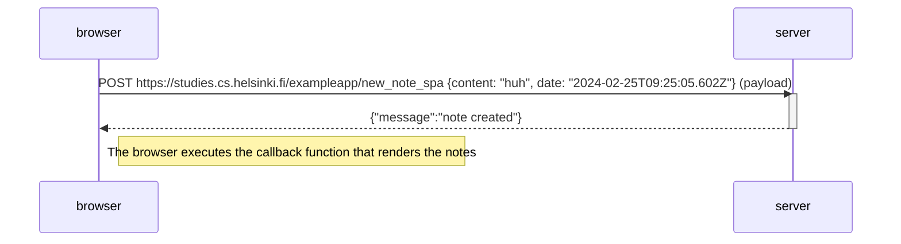

# 0.5: Single page app diagram
> Sequence diagram depicting the situation where the user creates a new note using the [single-page app version](https://studies.cs.helsinki.fi/exampleapp/spa) of the notes app. (check with inspect, network, check disable cache, headers tab, general and response headers)

